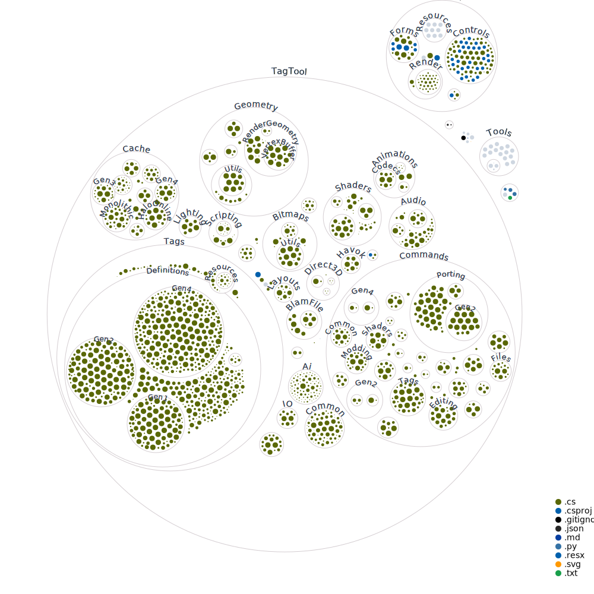

# Universal Tag Editor
A command-line tool forked from TagTool designed to aid in the research and modification of Halo cache files. 

## We've included the generated diagram by adding it to the README:

You can check out the whole GitHub Action at [diagram.yml](/.github/workflows/diagram.yml).
